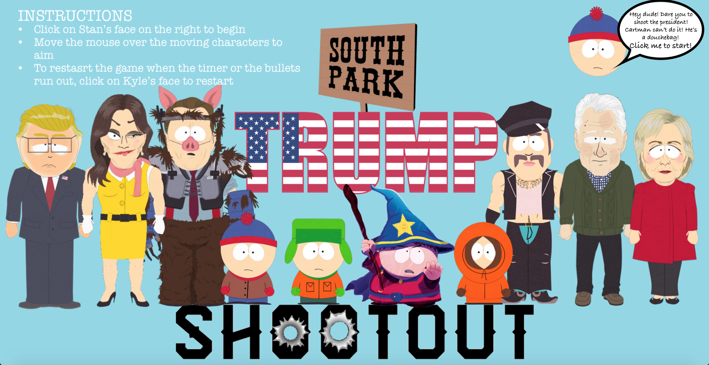

# Project-1

## GENERAL ASSEMBLY Project 1: A simple, single page, front end game.

- [Click here to play South Park's Trump Shootout game](https://maxcramer.github.io/Project-1/)

### Instructions

* Click on Stan’s face on the right to begin
* Move the mouse over the moving characters to aim & click the mouse to shoot
* To restart the game when the timer or the bullets run out, click on Kyle’s face to restart

### Technology Used During Build

* HTML5
* HTMLAudio
* Animation
* CSS
* JavaScript
* Sketch App
* Git
* GitHub

#### Home Page

#### During Game Play

#### Game Over Screen

### Process

#### Original Idea / Sketch
I started designing with pen & paper, to get the basic design and functionality of the game, giving myself a good starting place with a solid plan of how the game will work.

### Wireframe
#### How the wireframe started
I decided to first of all make a very basic wireframe that makes the "targets" disappear for one second then reappear. Each click on a target would add 1 point and no bullets would be taken away. Should a click land outside of the target, no points were added and one bullet was taken away until reaching 0 when the game would be over.

#### Blockers & Bugs
- One of my biggest blockers was getting both the timer & the bullet count to stop at 0. I was able to overcome this by using "clearinterval(intervalId)" but I did learn a lot while doing this. After creating this stop it also gave me the opportunity to link the buttons  such as the start & restart to ensure that the clock only restarted when either of these buttons were clicked.

- Another main blocker I had was linking the sound effects to a specific target and to only play when that target is clicked. I was able to overcome this by creating an array with all the target images in, with this, linking each audio file to each target within the array. Now certain sound effects will only play when a certain target has been clicked on.

#### Wins
My biggest wins with this were learning how to animate each "target" (div) to move around the page independently and randomly, choosing from a number of different "keyframes " and also generating a random duration to move across the screen.

My other big win was getting the "targets" (div) to disappear for one second only, then reappearing on the screen. This gave me the ability to make it appear as if once the "targets" (divs) are "shot" or hit they disappear like at the old fashioned carnival "duck shooting" games.

### Future Features

#### Mobile responsive:
- Had I had more time, I would have made the game work on mobile. I would have done this by adding functions that listen to "clicks" from the finger rather than a mouse. This would have allowed the game to be played on mobile & make the game portable.

#### Leaderboard:
- Another aspect I had previously hoped to add would have been a leaderboard and the ability to log your score on a local repository after the game has ended. Unfortunately I had run out of time before I had the opportunity to create a leaderboard.
